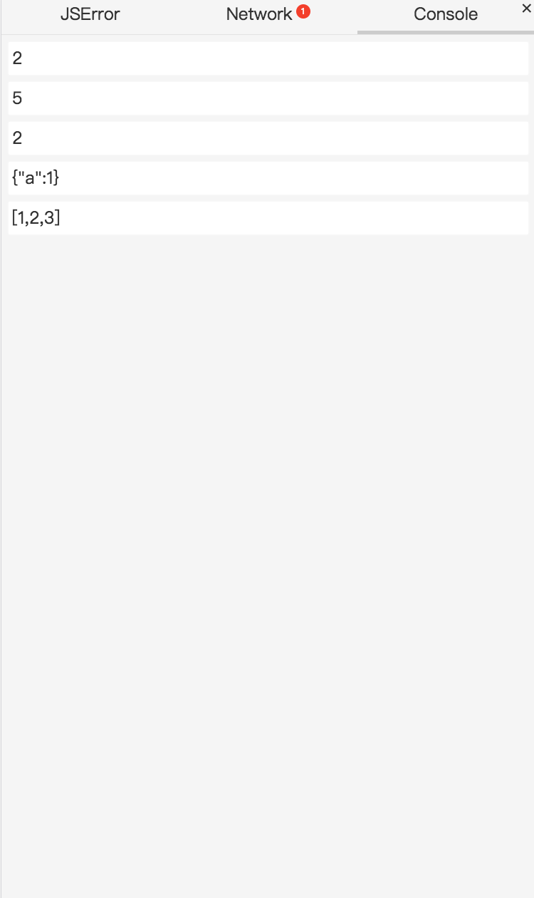
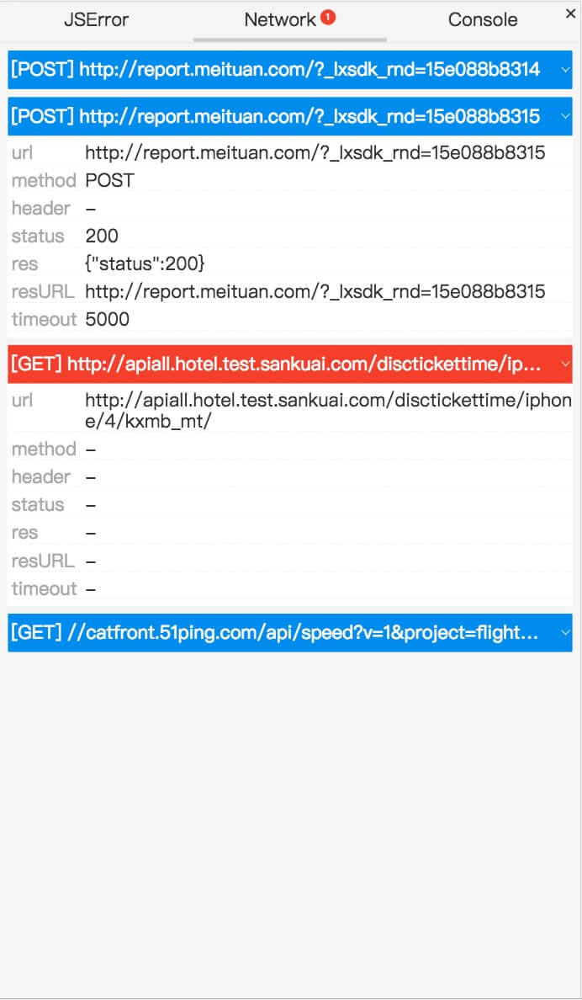
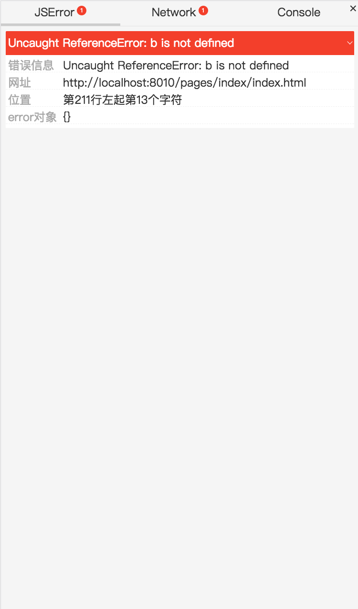

# conanjs使用文档

## 需求背景
调试移动端web应用（尤其是i版页面）时，在没有类似于PC端控制台的环境下进行错位定位/处理是一件较为困难的事。conanjs通过为开发者收集必要的调试/错误信息并展示，为开发者提供友好且高效的调试体验。

## 目的

收集以下三类信息并展示：

- JS运行错误
- HTTP请求信息
- 通过console语句打印的控制台输出

界面示例：








## 使用

### 引入

在html中引入：

```html
<script src="./conan.min.js"></script>
```

### 初始化

`conanjs`在全局`window`对象上挂载了脚手架方法：

```javascript
window.conan({
  // 用户配置项
});
```

### 可配置项

> *为暂未开放项

#### *tagHttpRequest:[Function]

用户可根据HTTP请求对象为该请求打标签（成功，失败，警告等或自定义类型）：

```javascript
const tagHttpRequest = function (http) {
  switch (http.resStatus) {
    case 200: {
      return 'success';
	}
    default: {
      return {
        name: 'custom',
        color: '#000'
      };
    }
  }
}
```

可供返回的值：

| 返回值类型  | 说明    | 示例                                      |
| ------ | ----- | --------------------------------------- |
| String | 预设值   | ```success/error/warning/important``` |
| Object | 自定义标签 | ```{name: 'custom', color: '#000'}```   |
